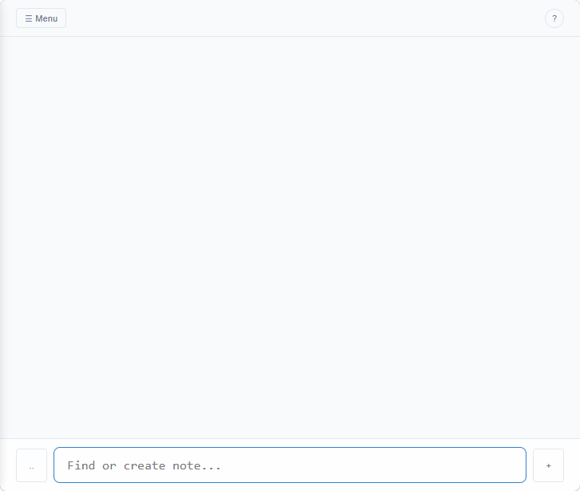

# dotNote
`type, find, expand.`

A minimalist, keyboard-first, note system built around full-text search and text expansion.



## Live Access
**dotNote** is a single-file application, it works entirely offline, however, it is also availble online: **[https://foxtrot-roger.github.io/dotNote/index.html](https://foxtrot-roger.github.io/dotNote/index.html)**

**Take it with you:** Right-click the link above and select `Save Link As`, then open the downloaded page.

⚠️ Do not save the webpage (`Ctrl+S`) from the browser as the page is generated on the fly.
⚠️ Beware that if you move or rename the downloaded file, you need to export your data first and import it after opening the new file. If you did and your data is "gone", just move the html file back to where it was (path and name) and reopen it, your data is there, export then rename.

## TLDR; How it works

You type → **dotNote** expands:
- system functions start with `..`
- you can extend: create a note that starts with  `..`
- everything is stored in the browser's IndexedDB → your data doesn't leave your browser
- for ease of use, you can synchronise with JSONBin (or similar provider, I am not affiliated with any)

## 🚀 The Philosophy

No folders, no schemas, only `..yourStenos`.

- **~~organize~~ → find** : searching is faster than filing
- **~~structure~~ → syntax** : plain text is the ultimate data format
- **~~datamodel~~ → your conventions** : you define the rules, not the app

## Features
- filter notes by word order
- special notes starting with `..` are stenos
- stenos will show up suggestions when typing
- the search bar acts as note creation input
- to search stenos start the search with `..`

### Stenos
- stenos names can be overloaded
- the steno format is "..keyword replacement" and is visible as "keyword"
- eg. "..my_keyword my custom text" → the user types "my" is presented with "my_keyword" → inserts "my custom text"

You can create custom stenos just by writing a note:
- **Create a note:** `..todo !todo ..date :` 
    - *Result:* Typing `..todo` will expand to `!todo 2026-05-09 :`
- **Create a note:** `..jcc Jean-Claude Convenant`
    - *Result:* Typing `..jcc` will expand to `Jean-Claude Convenant`

⚠️ dotNote intentionally does not support expansion of stenos recursively.
Given the stenos :
- `..inner ..date INNER`
- `..outer ..inner ..time`

When typing `..outer` dotNote will expand to `..inner 14:05`

### System functions

dotNote provides system functions for dynamic things, they all start with `..`:
- `..now` → `2026-05-09 13:19` (Current date and time)
- `..date` → `2026-05-09` (Today's date)
- `..time` → `13:19` (Current time)
- `..tomorrow` → `2026-05-10` (Tomorrow's date and time)
- `..` → Opens the expansion menu to show you what's possible.

### Import / export
- "cloud" synchronization through webhooks
- import file and replace all
- import file and update notes with matching keys
- export all
- export notes
- export vocabulary
- download standalone

### For mobile
- search bar : insert steno button `..`
- search bar : create button "+"
- export prompts for share with other apps 

## Example stenos
``` 
..freeze !freeze ..today
!followup ..date+3month
!followup ..date+6month
!purge ..date+9month
```

```
..funw !followup ..week+1week
```

```
..shout !shout
!followup ..date
!followup ..date+1day
!followup ..date+2day
!followup ..date+3day
!followup ..date+4day
!followup ..date+5day
!followup ..date+6day
!followup ..date+7day
```

```
..wait !waiting
!lastnews ..today
!followup ..date+3week
!burn ..date+4week
!purge ..date+5week
```